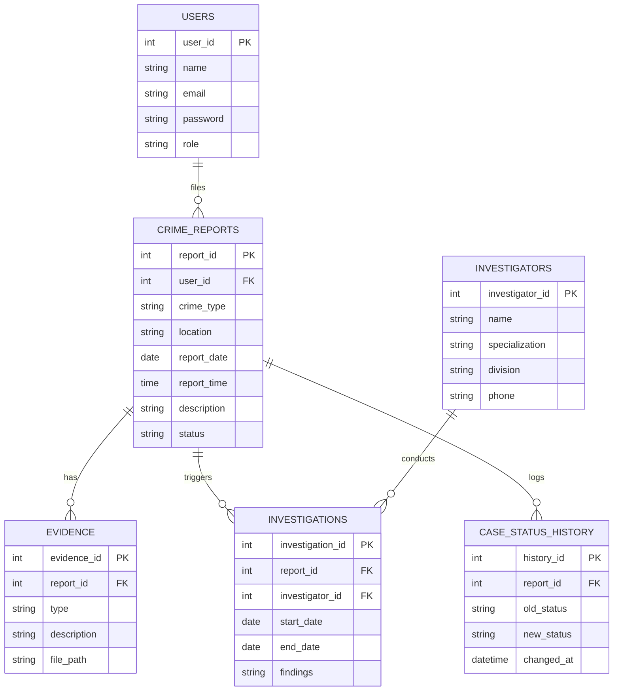

 ER Diagram

## Entity-Relationship Diagram

## Entities and Relationships

| Relationship | Cardinality | Description |
|---|---|---|
| USERS → CRIME_REPORTS | 1 : N | A user can file many crime reports |
| CRIME_REPORTS → EVIDENCE | 1 : N | A report can have multiple pieces of evidence |
| CRIME_REPORTS → INVESTIGATIONS | 1 : N | A report can have multiple investigations opened against it |
| CRIME_REPORTS → CASE_STATUS_HISTORY | 1 : N | A report's status changes are logged over time |
| INVESTIGATORS → INVESTIGATIONS | 1 : N | An investigator can be assigned to multiple investigations |

## Notes

- `CRIME_REPORTS.status` holds the **current** status; `CASE_STATUS_HISTORY` is an audit log of every status transition (old → new, with timestamp).
- `EVIDENCE.file_path` implies file storage (e.g. photos, documents) is referenced, not stored directly in the database.
- All foreign keys (`FK`) reference the primary key (`PK`) of their parent entity.
