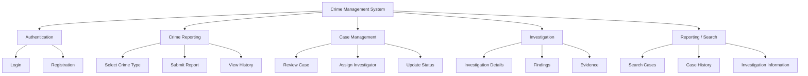
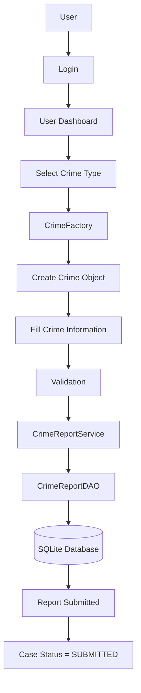
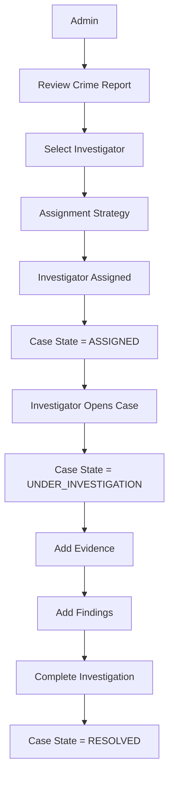
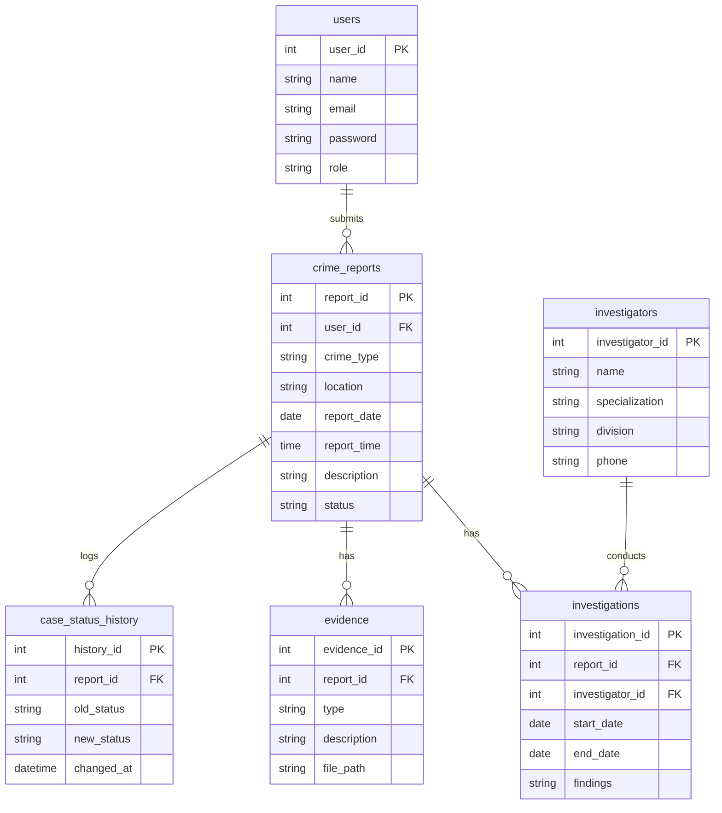
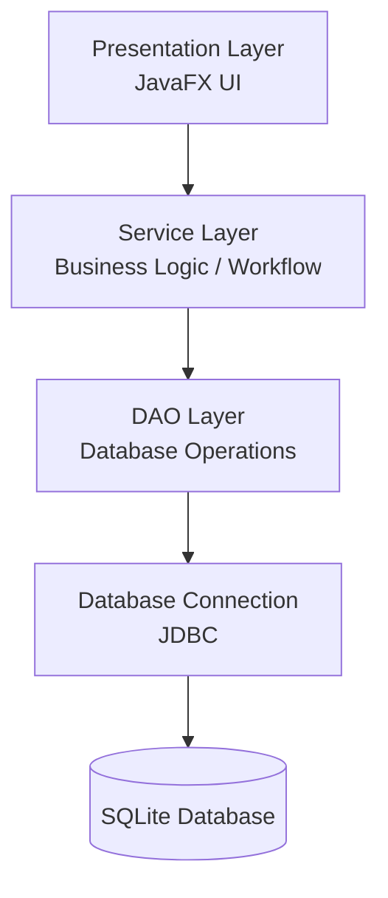

# 10. Technical Documentation

## 10.1 Project Title

**Crime Management and Reporting System**

**Project Type:** Desktop application

**Technologies**

| Technology | Purpose |
|---|---|
| Java 17 | Programming language |
| JavaFX 17 | Graphical User Interface |
| Maven | Build / dependency management |
| SQLite | Persistent database |
| JDBC | Database connectivity |
| GitHub | Version control |
| JUnit 5 | Testing |

---

## 10.2 System Objective

The system provides a desktop-based platform for managing crime reports and investigations. Users can submit crime reports, while authorized personnel review reports, assign investigators, manage investigations, maintain evidence records, update case statuses, and monitor case progress.

---

## 10.3 Main Users

| Role | Capabilities |
|---|---|
| **General User** | Register, login, submit crime report, select crime type, enter crime information, view submitted reports, track case status |
| **Administrator** | View crime reports, review cases, manage investigators, assign investigators, monitor case status, view system information |
| **Investigator** | View assigned cases, investigate cases, add findings, manage evidence, update investigation status |

---

## 10.4 Major Functional Modules

---

## 10.5 Design Patterns Used

| Pattern | Where Used | Problem Solved |
|---|---|---|
| Factory | Crime creation | Creates different crime types centrally |
| Strategy | Investigator assignment | Supports multiple assignment algorithms |
| State | Case status | Handles different case states |
| Observer | Case notifications | Notifies interested users of changes |
| DAO | Database access | Separates SQL from business logic |
| Service Layer | Business operations | Separates business logic from UI |

Design patterns operate mainly around the business/domain layer.

---

## 10.6 Main Workflow 1 — Crime Reporting

---

## 10.7 Main Workflow 2 — Investigation

---

## 10.8 Database Tables

---

## 10.9 Architecture

Design patterns operate mainly around the business/domain layer (Service Layer).
