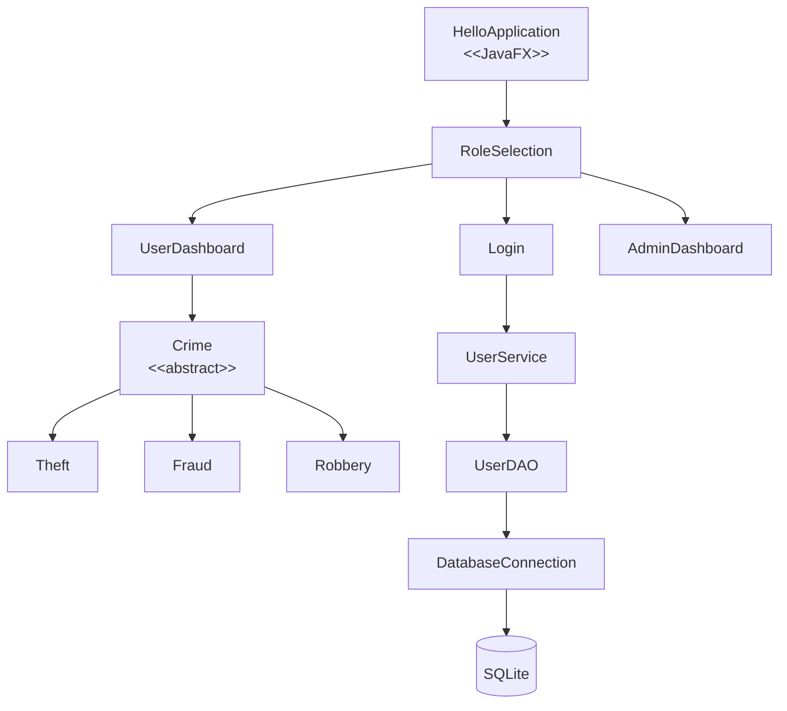
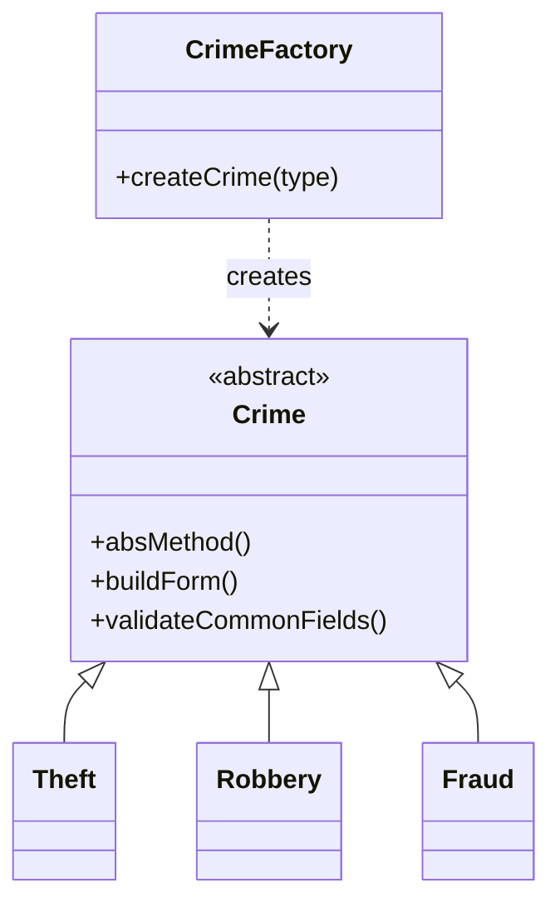
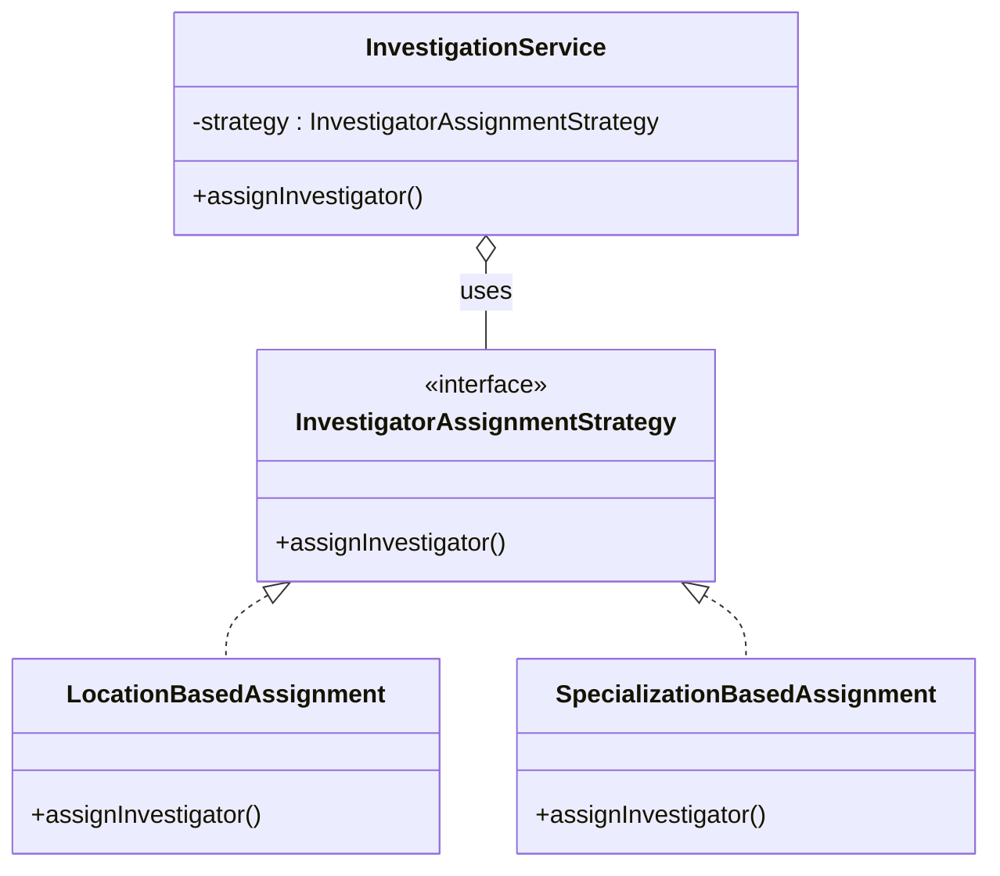
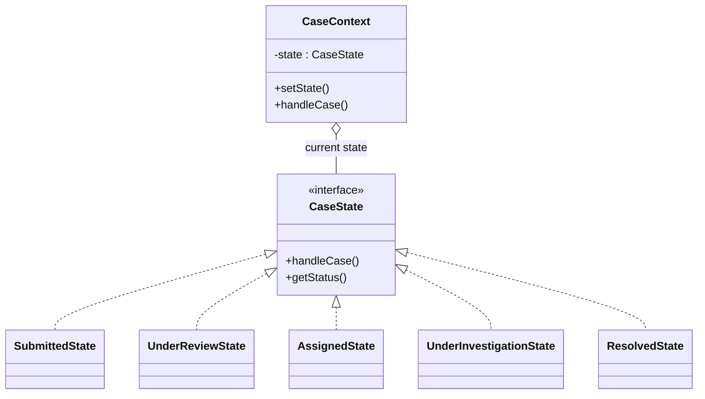
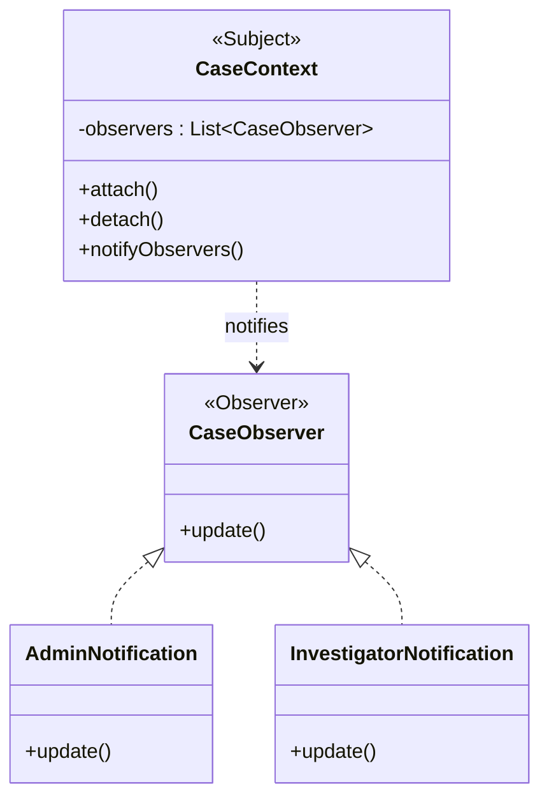
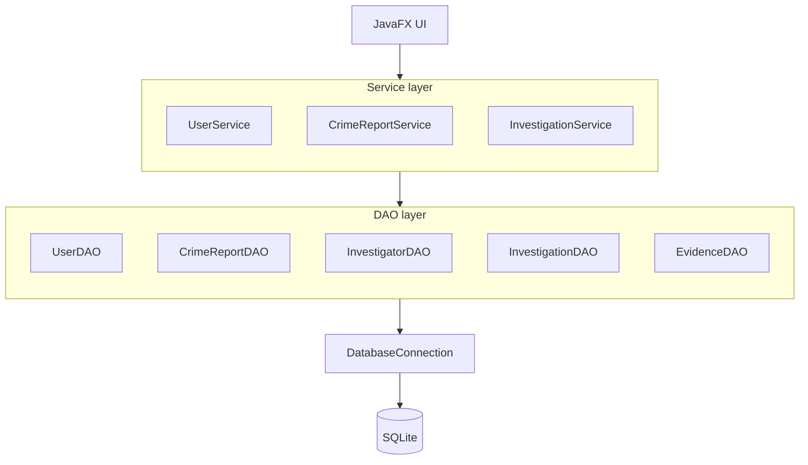
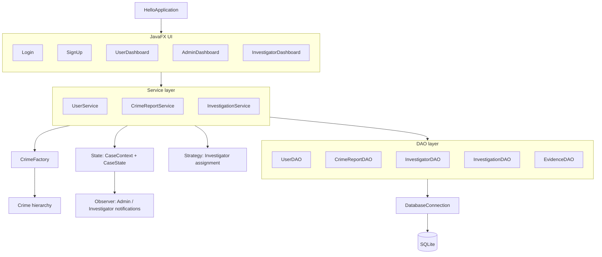

# Crime Reporting System — UML Diagrams

A full set of UML diagrams covering the domain model, design patterns, and layered architecture of the application.

## 1. Application navigation flow

---

---

## 2. Crime class hierarchy + Factory pattern

`Theft`, `Robbery`, and `Fraud` all extend the abstract `Crime` class. `CrimeFactory` encapsulates the logic for instantiating the correct concrete subclass (the **Factory Method** pattern).

---
## 3. Strategy pattern — investigator assignment

`InvestigationService` holds a reference to an `InvestigatorAssignmentStrategy` and delegates assignment logic to whichever concrete strategy (`LocationBasedAssignment` or `SpecializationBasedAssignment`) is plugged in at runtime — the **Strategy** pattern.

---
## 4. State pattern — case lifecycle

## 5. Observer pattern — case notifications

`CaseContext` doubles as the **Subject**: it maintains a list of `CaseObserver`s and notifies them on state changes. `AdminNotification` and `InvestigatorNotification` are concrete observers that react via `update()` — the **Observer** pattern.

---

## 6. Layered architecture — Service / DAO / Database

---

## 7. Full application architecture overview

---

## Design pattern summary

| Pattern | Participants | Purpose |
|---|---|---|
| **Factory Method** | `CrimeFactory`, `Crime`, `Theft`, `Fraud`, `Robbery` | Centralizes creation of the correct `Crime` subclass |
| **Strategy** | `InvestigatorAssignmentStrategy`, `LocationBasedAssignment`, `SpecializationBasedAssignment`, `InvestigationService` | Swaps investigator-assignment logic at runtime |
| **State** | `CaseState`, `SubmittedState`, `UnderReviewState`, `AssignedState`, `UnderInvestigationState`, `ResolvedState`, `CaseContext` | Encapsulates case-status behavior per lifecycle stage |
| **Observer** | `CaseContext` (Subject), `CaseObserver`, `AdminNotification`, `InvestigatorNotification` | Notifies interested parties when a case's state changes |

## Layer summary

| Layer | Components |
|---|---|
| Presentation (JavaFX UI) | `Login`, `SignUp`, `UserDashboard`, `AdminDashboard`, `InvestigatorDashboard` |
| Service | `UserService`, `CrimeReportService`, `InvestigationService` |
| Data Access (DAO) | `UserDAO`, `CrimeReportDAO`, `InvestigatorDAO`, `InvestigationDAO`, `EvidenceDAO` |
| Infrastructure | `DatabaseConnection` → `SQLite` |

## Notes

- Diagram 4 adds an inferred state-transition sequence since the original ASCII only grouped the states visually without arrows/labels between them — verify against your actual state-transition logic and adjust if needed.
- `CaseContext` appears twice in the source diagrams (once for State, once for Observer/Subject); it's shown as a single unified class in diagrams 4 and 5 since it plays both roles.
